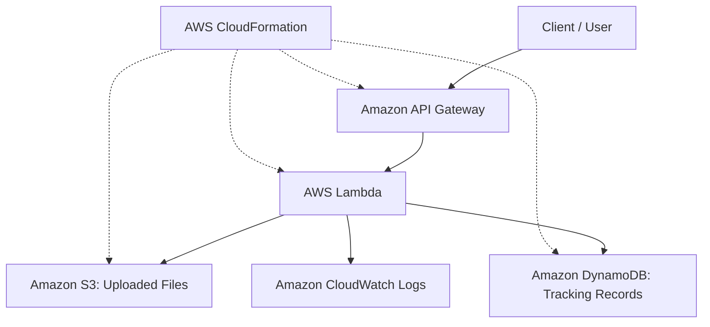

```mermaid
flowchart TD
    Client["Client / User"] --> API["Amazon API Gateway"]
    API --> Lambda["AWS Lambda"]
    Lambda --> S3["Amazon S3: Uploaded Files"]
    Lambda --> DB["Amazon DynamoDB: Tracking Records"]
    Lambda --> Logs["Amazon CloudWatch Logs"]
    CF["AWS CloudFormation"] -.-> API
    CF -.-> Lambda
    CF -.-> S3
    CF -.-> DB
```
